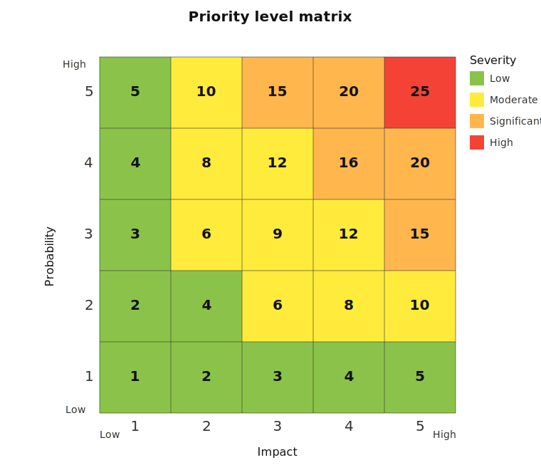

# Risk register

|       Risk ID       | Date       |  Priority level   | Status |
|:-------------------:|------------|:-----------------:|--------|
| [CWR-001](#CWR-001) | 2025-07-04 | **10** (moderate) | Open   |

---

Legend:

- **Risk description** - Brief summary of the risk.  
- **Impact description** - What will happen if the risk is not mitigated or eliminated.
- **Impact level** - Rate **1** `LOW` to **5** `HIGH`.
- **Probability level** - Rate **1** `LOW` to **5** `HIGH`.
- **Priority level** - **Impact × Probability**. Address highest first.  
- **Mitigation notes** - What can be done to lower or eliminate the impact or probability.
- **Owner** - Who's responsible?

---

## CWR-001

### Risk description

Starting with Rust version 1.87, the bulk memory proposal is required by the compiler.
However, Wasmer 5.0.6, which is used by CosmWasm, does not support this feature.
The issue is documented here: https://github.com/CosmWasm/cosmwasm/issues/2485.

Related issues:
- https://github.com/CosmWasm/wasmd/issues/2316

The crate `cosmwasm-vm` uses the last available open-source Wasmer Singlepass compiler
in version 5.0.6 which lacks support for the bulk memory proposal required by Rust 1.87.
Due to licensing changes in Wasmer, we cannot simply upgrade to a newer version.
More details here: https://wasmer.io/posts/singlepass-relicensing.
These licensing changes were introduced after Confio stopped funding Wasmer’s work,
which itself was a consequence of ICF discontinuing CosmWasm funding.

### Impact description

Smart contract compiled to WebAssembly with Rust ≥ 1.87
will be rejected from being stored on chain with the following error:

```text 
Deserialization error: "bulk memory support is not enabled (at offset 0x86f)"
```

**Workaround**: Compile smart contract with Rust version ≤ 1.86.

### Impact level


**2** | Developers may still (next few months) use Rust version ≤ 1.86 to compile their contracts.
 
### Probability level

**5** | Already happened. 

### Priority level
  
2 × 5 = **10** (moderate)

### Mitigation notes

Options we have:
- Do nothing, stick to Rust version 1.86 for compiling smart contracts.
- Implement bulk memory support ourselves in the open-source 5.0.x Wasmer Singlepass compiler.
- Upgrade to commercial version of Wasmer (and ask Wasmer team to implement required changes).
- Switch to a different WebAssembly engine (e.g. wasmtime or wazero).

### Owner

- ICL (reported at 2025-07-04)

---

> [!INFORMATION]
> Template for a new risk entry.

## CWR-XXX

### Risk description

(Brief summary of the risk.)

### Impact description

(What will happen if the risk is not mitigated or eliminated.)

### Impact level
 
(Rate **1** `LOW` to **5** `HIGH`.)

### Probability level

(Rate **1** `LOW` to **5** `HIGH`.)

### Priority level

(**Impact × Probability**. Address highest first.)
  
### Mitigation notes

(What can be done to lower or eliminate the impact or probability.)

### Owner

(Who's responsible?)

---

> [!INFORMATION]
> Reference matrix for priority levels 
 

