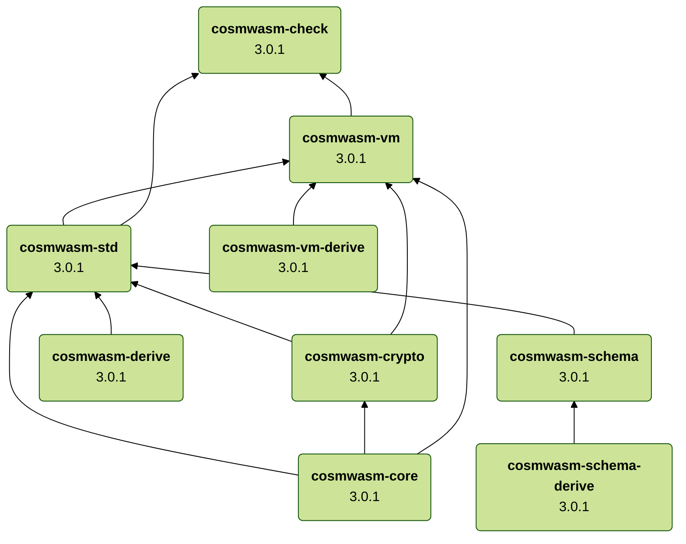
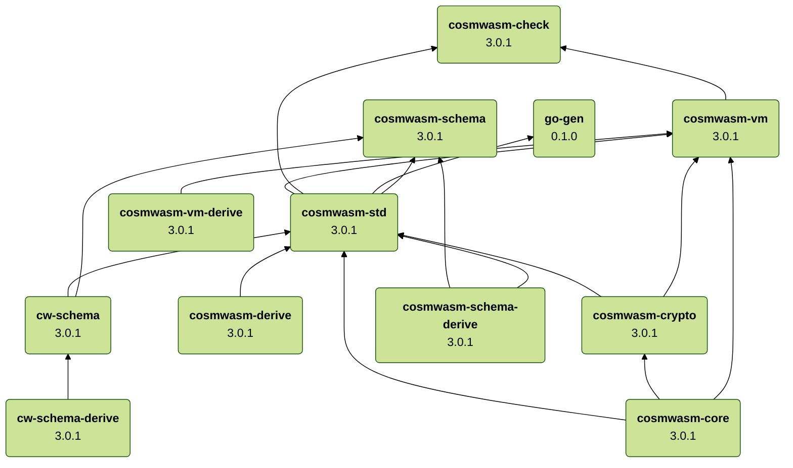

# Dependencies

## Viable (for today) CosmWasm dependencies

```mermaid
---
config:
  theme: 'forest'
---

graph BT
    A("`**cosmwasm-core**
        3.0.1`")
        
    B("`**cosmwasm-std**
        3.0.1`")
            
    C("`**cosmwasm-crypto**
        3.0.1`")
        
    D("`**cosmwasm-vm**
        3.0.1`")
        
    F("`**cosmwasm-vm-derive**
        3.0.1`")
        
    G("`**cosmwasm-derive**
        3.0.1`")    
        
    J("`**cosmwasm-schema**
        3.0.1`")

    K("`**cosmwasm-schema-derive**
        3.0.1`")
        
    L("`**cosmwasm-check**
        3.0.1`")
        
    A --> B
    A --> C
    A --> D
    C --> B
    C --> D
    B --> D
    F --> D
    G --> B
    K --> J
    B --> L
    D --> L
    J --> B
```

## All CosmWasm dependencies

```mermaid
---
config:
  theme: 'forest'
---

graph BT
    A("`**cosmwasm-core**
        3.0.1`")
        
    B("`**cosmwasm-std**
        3.0.1`")
            
    C("`**cosmwasm-crypto**
        3.0.1`")
        
    D("`**cosmwasm-vm**
        3.0.1`")
        
    F("`**cosmwasm-vm-derive**
        3.0.1`")
        
    G("`**cosmwasm-derive**
        3.0.1`")    
        
    H("`**cw-schema**
        3.0.1`")

    I("`**cw-schema-derive**
        3.0.1`")

    J("`**cosmwasm-schema**
        3.0.1`")

    K("`**cosmwasm-schema-derive**
        3.0.1`")
        
    L("`**cosmwasm-check**
        3.0.1`")
        
    M("`**go-gen**
        0.1.0`")    

    A --> B
    A --> C
    A --> D
    C --> B
    C --> D
    B --> D
    F --> D
    G --> B
    H --> B
    I --> H
    K --> J
    K --> B
    H --> J
    B --> L
    D --> L
    B --> M
    B --> J
```

