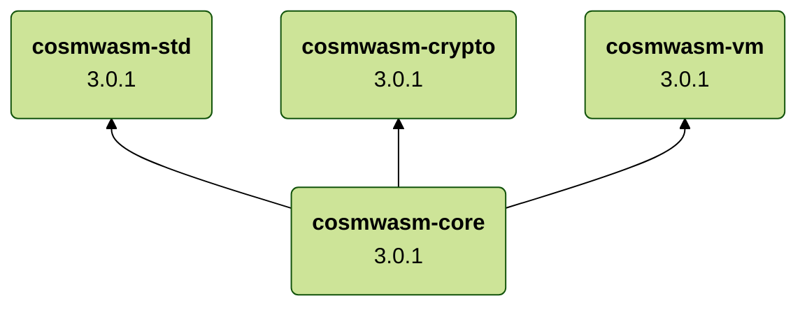

# Dependencies

```mermaid
---
config:
  theme: 'forest'
---

flowchart BT
    A("`**cosmwasm-core**
        3.0.1`")
        
    B("`**cosmwasm-std**
        3.0.1`")
            
    C("`**cosmwasm-crypto**
        3.0.1`")
        
    D("`**cosmwasm-vm**
        3.0.1`")    
    
    A --> B
    A --> C
    A --> D
```
