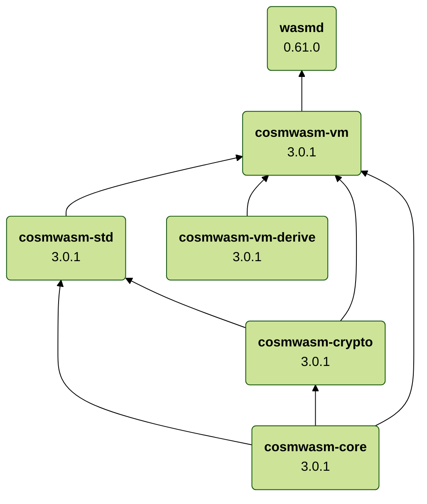

# Dependencies

## All maintained dependencies

```mermaid
---
config:
  theme: 'forest'
---

flowchart BT
    A("`**cosmwasm-core**
        3.0.1`")
        
    B("`**cosmwasm-std**
        3.0.1`")
            
    C("`**cosmwasm-crypto**
        3.0.1`")
        
    D("`**cosmwasm-vm**
        3.0.1`")
        
    F("`**cosmwasm-vm-derive**
        3.0.1`")    
        
    E("`**wasmd**
        0.61.0`")        
    
    A --> B
    A --> C
    A --> D
    C --> B
    C --> D
    B --> D
    D --> E
    F --> D
```
